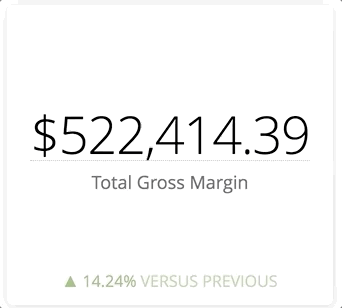

# Section 5

pull in new skin


```
git ...
```


It will feel very familiar, we've just added prepackaged styling from [Semantic UI](https://semantic-ui.com/). This is very similar to how you might use Looker components in the future, just using React.


Dynamic dashboard control starts with understanding what options we have to play with. We are going to start listening to the `dashboard:load` event to see the options that are available to us.


Create a function at the bottom of `demo.ts`

```js
function loadEvent (event: any) {
  if (event && event.dashboard && event.dashboard.options ) {
    gOptions = event.dashboard.options
    console.log('OPTIONS', gOptions)
  }
}
```

Call the function when you see the load

```js
.on('dashboard:loaded', loadEvent)
```

If you look at your console (Command+Option+j) you will see the options that are available to do dynamic dashboards. It will look something like this:


```js
{
  "layouts": [
  	{
  	  "id": 5,
  	  "dashboard_layout_components": [...],
  	  ...
  	}
  ],
  "elements": {
  	"36": {
  	  "title": "Total Gross Margin",
	  "vis_config": {...} 	  
  	},
  	...
  }
}
```

Head over to the Looker documentation on [dashboard:loaded](https://docs.looker.com/reference/embedding/embed-javascript-events#dashboard:loaded) for more explanation and a full set of options.

In short: these are the properties of the dashboard we are allowed to change for dynamic dashboard control.

The first thing we will try to change is every title on all the tiles. When we're selecting a dropdown, an idea that a designer might have is to reflect the state thats filtered on the tiles.

So lets create a function that will update the charts and graph tiles




```js
function changeTitles(elements: any, state: string) {
  const add_state = (state && state !== '') ? ` (${state})` : ''
  const new_elements = JSON.parse(JSON.stringify(elements))
  Object.keys(new_elements).forEach(el=>{
    console.log(new_elements[el].vis_config.title )
    if (new_elements[el].vis_config.type == "single_value") {
      new_elements[el].vis_config.title = new_elements[el].vis_config.title + add_state
      new_elements[el].title = ""
    } else {
      new_elements[el].title = new_elements[el].vis_config.title + add_state
    }
  })
  gDashboard.setOptions({elements: new_elements})
}
```

This function will loop through all the element keys and update the titles in each element. Single tile visualizations and other chart types have different title structures for display, so we have an if statement that updates the correct title for us. Once we've updated them all, we use our EmbedSDK variable, gDashboard to set the options to tell Looker to update; alternatively you could do this manually the old way with [Javascript Events](https://docs.looker.com/reference/embedding/embed-javascript-events#dashboard:options:set).

Now lets call this function where it makes most sense, the place where we listened for the dropdown change and updated the dashboard filters. On line XX right after `dashboard.run()` you can add the below to call the function.

```js
    changeTitles(gOptions.elements,(event.target as HTMLSelectElement).value)
```

In the case above we're both updating the visualization configuration and running at the dashboard so theres a reload. But the dashboard doesn't have to reload to set options. Lets take an example where we will change all of our visualizations to tables by clicking a button.

First lets create a function that accepts an input of the element we clicked on and

```js
function tableChange(table_icon: HTMLElement) {
  let new_elements = JSON.parse(JSON.stringify(gOptions.elements))
  const to_table = ( table_icon.getAttribute('data-value') == '0' ) ? true : false
  table_icon.classList.remove((to_table) ? 'black' : 'violet')
  table_icon.classList.add((to_table) ? 'violet' : 'black')
  table_icon.setAttribute('data-value', (to_table) ? '1': '0')
  if (to_table) {
    Object.keys(new_elements).forEach(element => {
      new_elements[element].vis_config.type = 'looker_grid'
    })
    gDashboard.setOptions({ elements: new_elements})
  } else {
    gDashboard.setOptions({ elements: gOptions.elements })
  }
}
```
This function does the following

1. Flips the color of the icon
2. Flips the value associated to the icon
3. Uses the value to determine if we are swapping to tables or from tables
4. If we're going to tables, it loops through each element and changes the vis_config.type to `looker_grid` then uses `.setOptions()` to set the visualization configuration
5. If we're moving from tables, it takes the default dashboard options

Now we need to call this function and pass it an HTML element for the button we're clicking. We can add this within the `setupDashboard` function underneath where we make our API calls for the first dropdown. You can put this starting on line XX.


```js
  const table_icon = document.getElementById('table-swap')
  if (table_icon) {
    table_icon.addEventListener('click', () => { 
      tableChange(table_icon)
    })
  }
```

bonus: Don't change the single value visualizations; wrap a condition around where we set `looker_grid`

```js
  if (new_elements[element].vis_config.type !== 'single_value' ) {
    new_elements[element].vis_config.type = 'looker_grid'
  }
```

### Vis Swap


Lets find a very specific tile and have a control that only updates that one tile. Donut charts suck, but execs love them, so lets create a button that lets you toggle the donut on and off. Lets do this by just targeting a single element.


We've been logging the options for dynamic dashboard control, so lets poke around in our console (Command+Shift+J) in there to find the `looker_donut_multiples`.

```js
{ 
  ...,
  "42": {
  "title": "Active Users",
  "title_hidden": false,
  "vis_config": {
    "type": "looker_donut_multiples",
  	...,
    "title": "Active Users"
  },
  ...,
}
```

So our element is 42, lets create a couple variables to help us swap in demo_config.ts


```js
const swap_element = "42"
export const new_vis_config = {
  "type": "looker_bar"
}
```

Import in demo.ts


```js
import { swap_element, new_vis_config } from './demo_config'
```

create function to swap; place at the end of `demo.ts`


```js
function swapVisConfig( icon: HTMLElement ) {
  if ( swap_element && gOptions && gOptions.elements && gOptions.elements[swap_element] ) {
    const elements = JSON.parse(JSON.stringify( gOptions.elements ))
    const to_original = (icon.getAttribute('data-value') === '1') ? true : false
    icon.classList.remove((to_original) ? 'black' : 'violet')
    icon.classList.add((to_original) ? 'violet' : 'black')
    icon.setAttribute('data-value', (to_original) ? '0': '1')

    if (to_original) {
      let new_element = { [swap_element]: elements[swap_element] }
      new_element[swap_element]['vis_config'] = Object.assign( new_element[swap_element]['vis_config'],  new_vis_config  )
      gDashboard.setOptions({ elements: new_element})
    } else {
      gDashboard.setOptions({ elements: gOptions.elements })
    }
  }
} 
```

Call function to swap on click; in `demo.ts` in the setupDashboard, at the end of the function at line XX.

```js
  const donut_icon = document.getElementById('vis-swap')
  if (donut_icon) {
    donut_icon.addEventListener('click', () => { 
      swapVisConfig(donut_icon)
    })
  }
```

### Layout

In `demo.ts`, switch dashboard

```
export const dashboard_id = 6
```

*Note:* We're switching dashboards; if you want to keep your vis swap you have to change `swap_element` too.

In `demo_config.ts` create an object that listens to the KPIs filter object

```js
export const dashbord_layout_filter = 'KPIs'
```

in `demo.ts` import the 

```js
import { dashbord_layout_filter } from './demo_config'
```

create a function to hide tiles

```js
function layoutFilter(filter: any) {
  const copy_options = JSON.parse(JSON.stringify(gOptions))
  const elements = copy_options.elements || {}
  const layout = copy_options.layouts[0]
  let components = (layout.dashboard_layout_components) ? layout.dashboard_layout_components : []
  
  const new_components: any = []
  filter = filter.split(',')

  components.forEach((c: any )=>{
    const found = elements[c.dashboard_element_id]
    if (filter.indexOf(found.title) > -1 ) {
      new_components.push(c)
    } 
  })
  layout.dashboard_layout_components = new_components
  gDashboard.setOptions({ layouts: [layout] })
}
```

call function in `demo.ts` at the end of filtersUpdate function

```js
  if (dashboard_filters && dashboard_filters[dashbord_layout_filter] && dashboard_filters[dashbord_layout_filter]) {
    layoutFilter(dashboard_filters[dashbord_layout_filter])
  }
```

### have one KPI on load

At the end of loadEvent function place this function

```js
  if (event && event.dashboard && event.dashboard.dashboard_filters) {
    const dashboard_filters = event.dashboard.dashboard_filters
    if (dashboard_filters && dashboard_filters[dashbord_layout_filter] && dashboard_filters[dashbord_layout_filter]) {
      layoutFilter(dashboard_filters[dashbord_layout_filter])
    }
  }
```

Then place a default filter for the KPI field

```js
  .withFilters({
    [dashbord_layout_filter]: 'Active Users',
    [dashboard_date_filter]: '30 days'
  })
```

Your dashboard should collapse to just the Active Users tiles